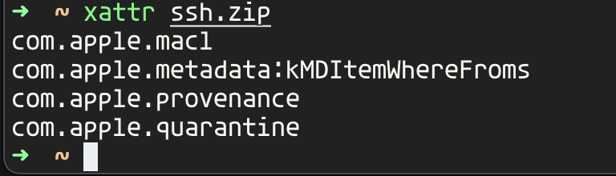
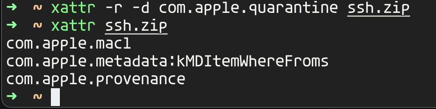

# Extended Attributes

### View a files extended attributes

```
xattr <filename>
```

<figure><figcaption></figcaption></figure>

### Delete an extended attribute

**-r** recursive

**-d** delete

```
xattr -r -d <attribute> <filename>
```

<figure><figcaption></figcaption></figure>
